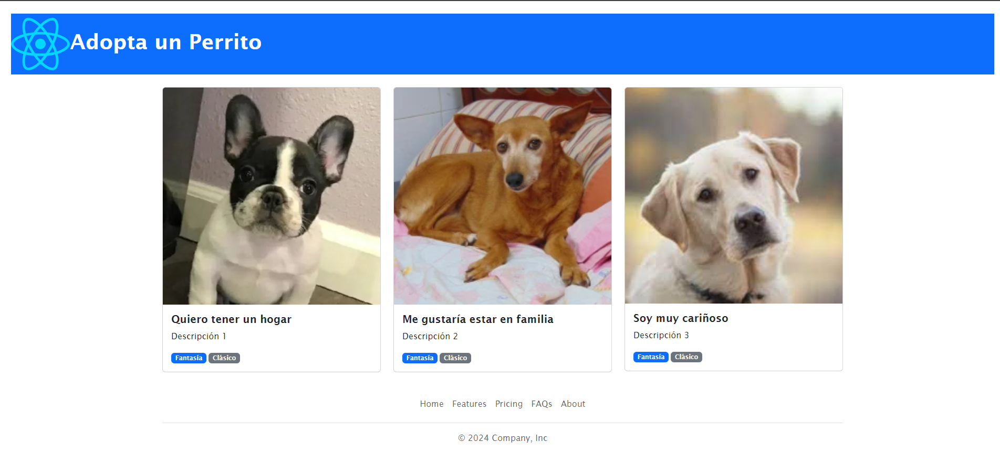

#Módulo 4 Introducción a REACT I - Desafío 1 Adopta un Perrito (React + Vite)

## Presentación de Página Web

 

---

 

## Descripción del PY ⌨️

Aplicando los conocimientos en la Introducción a REACT, se dearrolla el PY "Adopta un Perrito". Consta de cuatro componentes: Header, Mycard, Tags y Footer. La app debe llevar por nombre Adopta un perrito. El título "Adopta un Perrito" se especifica desde App.jsx a través de un prop. El componente MyCard.jsx recibe como props la dirección de la imagen,el nombre y la descripción del perrito. componente llamado Tags.jsx que se importará dentro de cada Card. El componente Mycard.jsx, utilizar el Badge de Boostrap y recibie como props el texto y color de fondo desde App.jsx, los cuales pasan desde App.jsx

## Tecnologías Usadas 🛠️

- **HTML** 💀
- **CSS** 🌈
- **JS** 🧑‍💻
- **REACT** 👌

 

---

 

## Autor 👨‍💻

**Luis Fernando Sanchez F. - G-60 - Grupo 1⚡**

Sígueme en mis redes sociales: 
 
